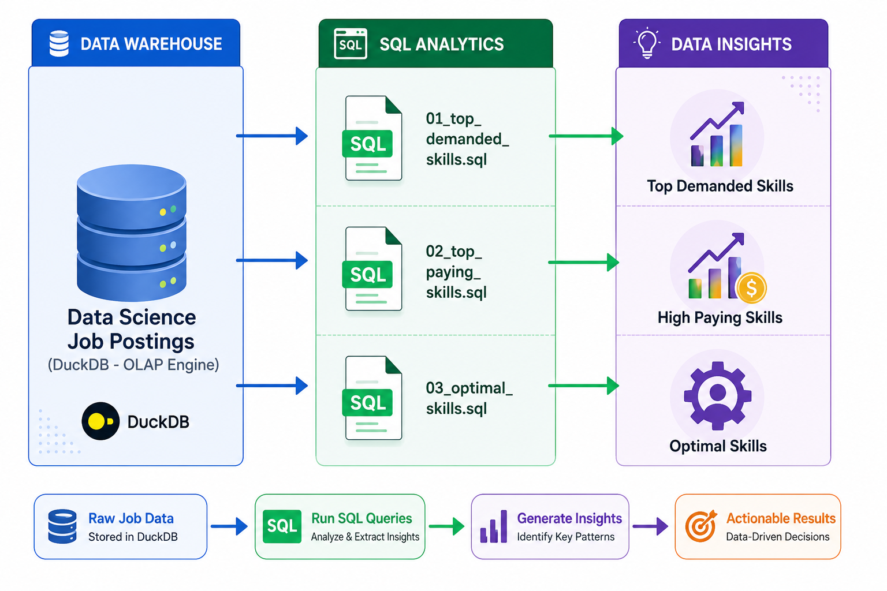

# Data Engineering Projects

**Hands-on projects to reinforce core data engineering concepts from the SQL for Data Engineering course.**

# Projects

### Exploratory Data Analysis (EDA)

SQL-driven analysis of the data engineer job market using advanced querying techniques.

**Skills:** Complex joins, aggregations, analytical functions, data quality validation.